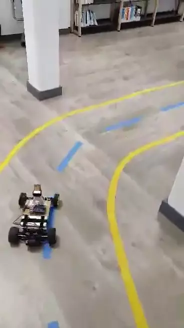
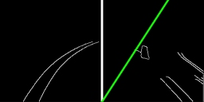
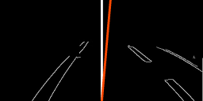

# Titanium Car = 🏎️ + 🤖
---
### Un projet fait à l'IMT Lille Douai 
#### avec le suivi du Professeur Hazem Wannous
#### Novembre 2019

## Le projet
---

L'objectif du projet s'insprire de celui du concours **IronCar** :

> Transformer une voiture téléguidée en voiture autonome et effectuer le plus rapidement possible un tour de circuit.

## Notre résultat
<div align="center">
    
</div>

## Le sommaire
1. [Le contexte](#le-contexte)
2. [L'installation](#installation)
3. [Les technos](#les-technos)
4. [La structure](#la-structure)
4. [La labelisation](#la-labelisation)
4. [Les auteurs](#les-auteurs)

Ce dépôt contient tous les notebooks et programmes faits durant le projet.

## Le contexte
---

TitaniumCar a été un projet d'initiation au deep learning et de découverte des différentes librairies de la data science. Il nous a permis de pratiquer toutes les étapes qu'un projet de data science peut avoir : 
 * Définition de la problématique
 * Conception
 * Création du dataset
 * Apprentissage
 * Tests
 * Déploiement


Le projet ne durant qu'un seul mois, le code a dû être restructuré par la suite. Le code destiné à être deployer sur la voiture pourrait contenir des bugs. Le reste du dépôt a été testé.


## Installation
---
Pour pouvoir expérimenter et utiliser directement le code, l'environnement Conda a été exporté. L'installation se fait simplement avec :

```bash
conda create -n titaniumcar python=3.7
conda env update --file environment.yml
```

Cette méthode est plus simple à mettre en place que celle décrite dans le rapport pdf.

Les données étant volumineuses, elles doivent être téléchargées séparément à cette adresse : 
[cdn.facchini.fr/92J7pN7jl8yQTZfp/data_titaniumcar.zip](https://cdn.facchini.fr/92J7pN7jl8yQTZfp/data_titaniumcar.zip)

## Les technos
---
Le langage utilisé pour l'ensemble du projet est python 3.7. Ensuite les principales technos utilisées sont :
 * Numpy
 * OpenCV
 * Tensorflow (et Pytorch)
 * Pygame
 * Picamera et Adafruit

## La structure
---
Le projet a été séparé en 5 parties :

 * **Experimentations** : Tous les tests que nous avons effectués mais qui n'ont pas été utilisés dans la version finale du projet
 * **Processes** : Les notebooks pour tester les modèles de prédictions
 * **Titaniumcar** : Code source pour la conduite de la voiture 
 * **Labeling** : Méthodes pour la labélisation des photos prises par la voiture
 * (**Data** : comprend le dataset, les vidéos et les tests, doit être téléchargé)
 
Le dépôt contient aussi le **rapport complet** du projet au format pdf.

## La labelisation
---
L'apprentissage du CNN nécessite une grande quantité d'images. La solution adoptée est de labéliser des photos prises par la voiture. Nous avions plus de **18 000 frames**.



Un programme a été fait pour définir avec la souris les **2 labels** (nombres réels)  :
 * la direction des roues
 * la puissance du moteur

En étant 4 personnes, nous mettions **1 heure** pour toutes les labéliser avec notre méthode.

## Les auteurs
---
La partie logicielle a été conçue par :

* **Pierre Montroeul**
* **Antone Facchini**